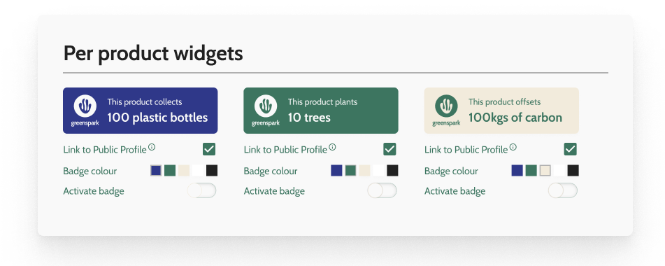
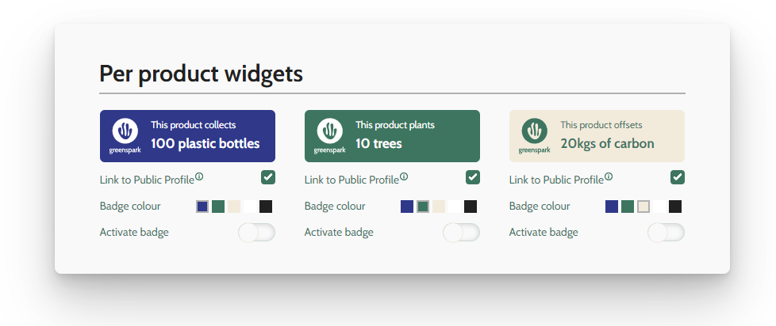
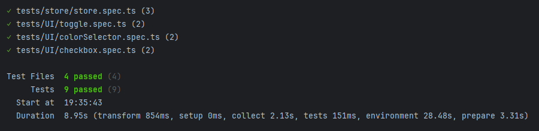

# Widget Project

Coding test - Vue 3 + TypeScript + Vite + Pinia


:computer: [Live Demo](https://widget-project-nine.vercel.app/)


## Extra Libraries

- Vitest (Testing) - Used to test components
- Pinia - State management library

## Why Pinia? (Pinia vs Vuex)

- Vuex is a great library, but it has some limitations. It is not type-safe, and it is not easy to use with TypeScript.
- Pinia is a new state management library that is built with TypeScript in mind. It is easy to use, and it is type-safe.
- It also has a great developer experience, and it is easy to test.
- This project uses Pinia Setup Store, similar to the Vue 3 Composition API.

## Notes & Features

- No CSS framework was used in this project. The CSS was written from scratch.
- Some design decisions were made to make the project look better.
- Transitions and animations were added to make the project look more professional and smooth.
- No external libraries were used for transitions and animations. Everything was written from scratch.
- No component library was used. All components were written from scratch.
- You can run the project with Docker or locally. (check the instructions below)

## Design vs Code

### **Design**



### **Code**



## Dev Notes
Given the client's use of Vue.js and TypeScript, I've developed the solution using Vue version 3 along with TypeScript. While Vuex was mentioned, I found it more optimal and advisable to use Pinia for state management today. Pinia's ease of use and its integration with both Vue 3 and TypeScript provide an excellent development experience, ensuring type safety and performance. Although no CSS library was specified, I chose to design purely with SCSS to make the build lighter. I've abstracted the components as much as possible, partly keeping the SOLID principles in mind for better code readability and structure.

Through Pinia, detailed states mentioned in the task description, such as color mutations and the control of checkboxes and toggle buttons, are managed. I've added extra animations like transitions when changing colors, shading for the checkbox and toggle button in the ripple effect, and in color selection, making the transitions smoother.

I opted to use SCSS and create a global color palette for use in the solution. I've conducted tests using Vitest on both the abstracted components and those created for the UI (checkbox, toggle button, color selector).

## Run Locally

Clone the project

```bash
  git clone https://github.com/jtejederabit/widget-project
```

Go to the project directory

```bash
  cd widget-project
```

Install dependencies

```bash
  npm install
```

Start the server in dev mode

```bash
  npm run dev
```

Build the project

```bash
  npm run build
```

## Deployment

To deploy this project with Docker

```bash
  docker-compose up --build
```

## Base URL

In Dev mode

```bash
  http://localhost:5173
```

From Docker container

```bash
  http://localhost:80
```

## Run tests


```bash
  npm run test:unit
```

